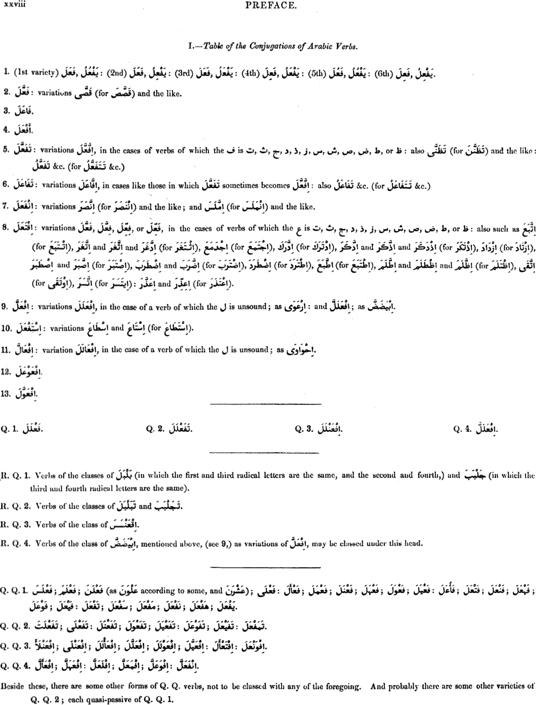
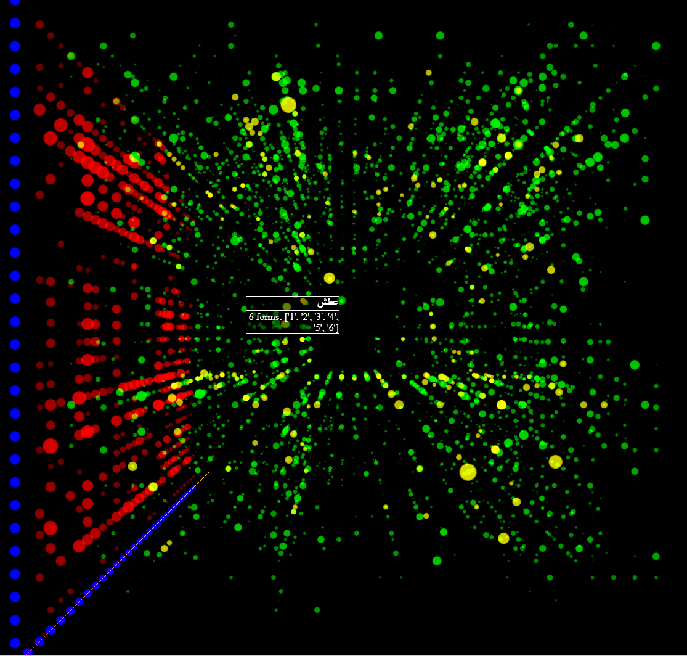
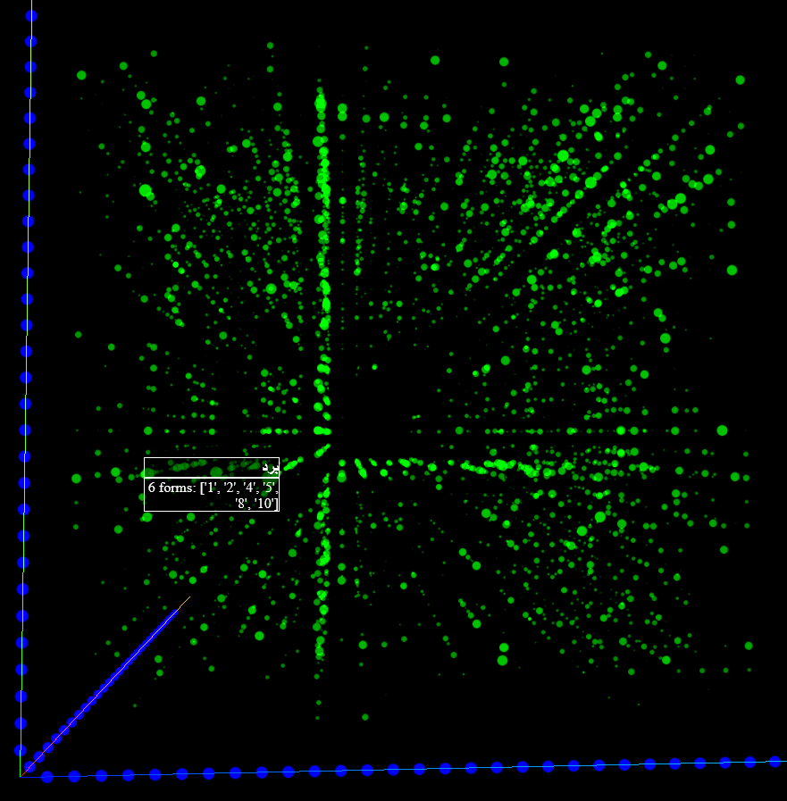

# Background

## What is it?

Arabic roots are placed within the space of a 3D cube according to the place of their constituent letters in the alphabet. You can click and turn the cube in any direction, zoom using the scroll wheel, as well as select/deselect subsets of the data to view only roots of certain categories. When you hover over a single root it will display the details of the root and the forms listed in the lexicon.

## What lexicon?

The data based on the text that has been taken from the Perseus project which has compiled the entire text of Lane's Lexicon online in xml and other formats:
http://www.perseus.tufts.edu/hopper/collection?collection=Perseus%3Acorpus%3Aperseus%2Cwork%2CLane%2C%20An%20Arabic-English%20Lexicon

## Legend

The following page from Lane's Lexicon is required to decipher to "forms" of each root as listed when you hover over a certain root.



Given the fact that most Arabic roots consist of 3 letters, it seemed interesting to plot them in a 3D space to see if there are any interesting patterns. The data was generated by parsing the xml of Lane's Lexicon as published by the Perseus Tufts project.

# Observations

## Open square in the middle as seen from all sides

From all sides of the cube it appears there's a square in the middle. This seems to be due to the fact that very few roots have more than 2 of the following letters:
"س","ش","ص","ض","ط","ظ"



Of course a rare but notable exception that proves the rule is shown, namely عطش (to sneeze), and one could argue at least this one only appears here due to onomatopoeia.

## The letter ر seems to be the most popular for second and third letter of roots



The image appears to show that the letter ر seems to be rather popular compared to all other letters. Whether this is an optical illusion or backed by hard data is shown below...


## Total frequency of forms

Which verb forms are listed most overall?

```
   3367 1
   2108 4
   1948 2
   1638 5
   1238 8
    968 3
    732 6
    730 10
    477 7
    225 R.Q.1
    170 Q.1
    112 R.Q.2
    106 Q.Q.1
     70 9
     63 Q.2
     56 11
     48 Q.Q.2
     48 12
     36 alphabetical letter
     34 Q.Q.4
     23 Q.4
     16 Q.Q.3
      9 Q.3
      6 R.Q.3
      4 13
      1 R.Q.4
```
## Which letters occur the most at place no. 1, 2 and 3?

### 1st letter

letter	Count - 1st letter
ن	260
ر	238
ع	227
س	210
ح	208
ف	200
و	194
ب	183
ق	176
م	175
ش	172
خ	157
ج	152
ك	148
ل	138
د	134
ا	133
ص	131
ه	126
غ	123
ز	113
ط	94
ض	81
ت	65
ث	58
ذ	54
ظ	21
ي	16
آ	2
ى	0

### 2nd letter

The below stats prove that the picture above that appears to show an abundance of roots having ر as their middle or last letter is backed by hard data.

letter	Count - 2nd letter
ر	371
و	297
ل	244
ب	238
ي	234
م	216
ن	182
ف	170
د	152
ه	139
ج	137
ع	134
س	132
ح	128
ق	122
ك	107
ش	104
ز	103
ت	102
ط	99
آ	93
ص	89
خ	82
ذ	75
ض	67
غ	65
ث	61
ظ	27
ى	15
ا	4

### 3rd letter

letter	Count - 3rd letter
ر	345
ب	251
ل	248
م	223
د	210
و	203
ى	183
ف	172
ن	165
ق	151
ع	144
آ	143
ح	141
س	131
ج	112
ط	99
ت	96
ث	81
ش	66
ه	63
ك	63
خ	62
ز	58
ص	57
ض	50
غ	32
ذ	28
ظ	18
ا	5
ي	4

### Most used overall

letter	Most used overall
ر	954
و	694
ب	672
ل	630
م	614
ن	607
ف	542
ع	505
د	496
ح	477
س	473
ق	449
ج	401
ش	342
ه	328
ك	318
خ	301
ط	292
ص	277
ز	274
ت	263
ي	254
آ	238
غ	220
ث	200
ى	198
ض	198
ذ	157
ا	142
ظ	66
